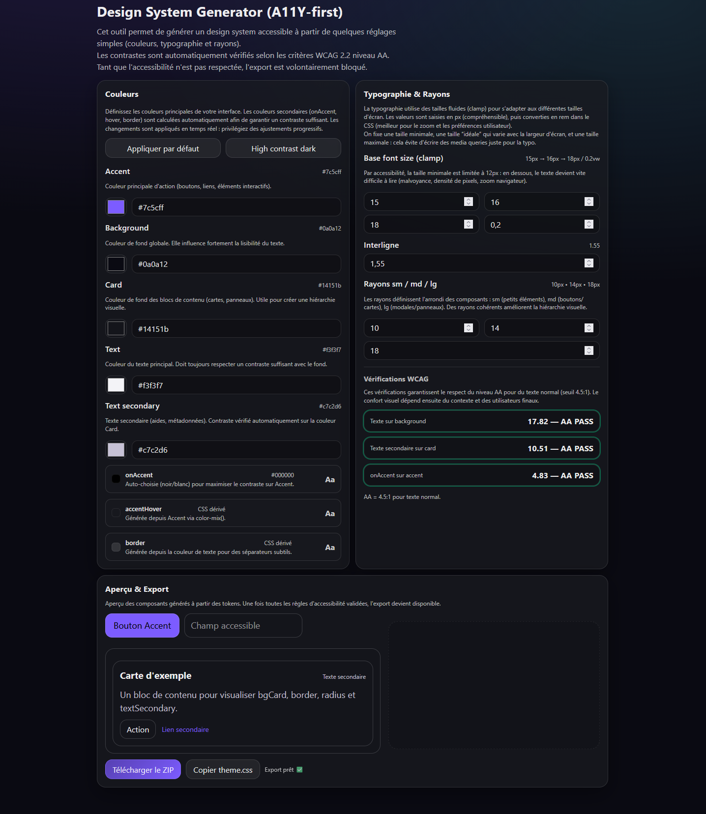
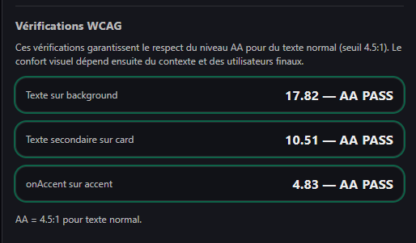
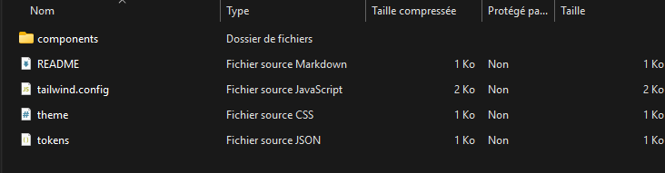

# A11Y Design System Generator - React + TypeScript

[](https://github.com/ton-username/08-a11y-ds-generator)
[](https://www.typescriptlang.org/)
[](https://react.dev/)
[](https://www.w3.org/WAI/WCAG22/quickref/)
[](./LICENSE)
[](https://a11y-ds-generator.vercel.app)

**Author:** Léa François  
**Project:** A11Y Generator - Accessibility-First Design System Tool  
**Tech Stack:** React + TypeScript + Vite + Vitest + culori


## Live Demo

🔗 **[Try it live](https://a11y-ds-generator.vercel.app/)**

---

## About the project

This project is an **accessibility-first design system generator** that helps developers and designers create WCAG 2.2 AA compliant color palettes and design tokens.

The tool **automatically validates contrast ratios**, generates CSS variables, and exports a complete ready-to-use design system package including React components and Tailwind configuration.

**The main goal** was to combine my **UX/UI design expertise** with my **accessibility specialization** and **newly acquired React/TypeScript skills** (Wild Code School bootcamp) to build a tool that solves a real problem: making accessible design systems easy to create.

---

## Features

### Smart Color System
- **Automatic contrast validation** (WCAG 2.2 AA)
- **Intelligent onAccent color picker** (auto-selects black or white for optimal contrast)
- **Derived colors** computed in CSS (border, accentHover)
- **Real-time preview** of all color combinations
- **Preset palettes** (Default, High contrast dark)

### Fluid Typography
- **Responsive font sizing** using CSS `clamp()`
- **Customizable min/preferred/max sizes**
- **Viewport-based scaling** (fluidVw coefficient)
- **Line-height control**

### Complete Export
- **tokens.json** - Design tokens in JSON format
- **theme.css** - CSS custom properties
- **tailwind.config.cjs** - Tailwind CSS configuration
- **React components** - Accessible Button & Input
- **README.md** - Usage documentation

All exported components follow **WCAG 2.2 AA standards** and use CSS variables for consistent styling.

### Accessibility-First
- **WCAG contrast validation** before download
- **Semantic HTML** structure
- **ARIA labels** and landmarks
- **Keyboard navigation** support
- **Focus indicators** on all interactive elements

---

## Tech Stack

| Technology | Role |
|------------|------|
| **React 19** | UI Architecture |
| **TypeScript** | Type safety & strictness |
| **Vite** | Build tool & dev server |
| **Vitest** | Unit testing (12 tests) |
| **culori** | WCAG contrast calculations |
| **JSZip** | Package generation |
| **file-saver** | File download |
| **Biome** | Linting & formatting |

---

## Main challenges

- Creating a **fully typed architecture** with TypeScript strict mode
- Implementing **WCAG 2.2 contrast algorithms** correctly (using specialized library)
- Building an **intuitive UX** for complex accessibility concepts
- Generating a **complete package** (not just CSS, but React components + config)
- Ensuring **real-time validation** without blocking the UI
- Writing **comprehensive unit tests** for contrast calculations

---

## What I learned

### Technical Skills
- Structuring a **scalable React application** with clean architecture
- Using **useMemo** for performance optimization
- Working with **advanced TypeScript types** (Omit, union types, mapped types)
- Writing **unit tests** with Vitest and Testing Library
- Implementing **CSS modern techniques** (clamp, color-mix, custom properties)

### Domain Expertise
- Deep understanding of **WCAG 2.2 AA contrast requirements**
- Auto-calculating **optimal text colors** for backgrounds
- Generating **fluid typography** systems
- Creating **derived design tokens** in pure CSS

### Best Practices
- **Separation of concerns** (core logic vs UI components)
- **Component composition** (reusable ColorInput, ColorSwatch)
- **JSDoc documentation** on public APIs
- **Test-driven development** for critical algorithms

---

## Project Structure
```
src/
├── core/                  # Business logic
│   ├── contrast.ts        # WCAG calculations
│   ├── tokens.ts          # Token builder
│   ├── exporters.ts       # CSS & ZIP generation
│   ├── templates.ts       # React component templates
│   ├── types.ts           # TypeScript definitions
│   └── __tests__/         # Unit tests (12 tests)
├── components/            # Reusable UI components
│   ├── ColorInput/        # Dual color picker
│   └── ColorSwatch/       # Color preview card
├── sections/              # App sections
│   ├── ColorSection/      # Color configuration
│   ├── TypographySection/ # Typography settings
│   └── PreviewExportSection/ # Preview & download
└── App.tsx                # Main application
```

---

## Installation & Usage

### Prerequisites
- Node.js 20+
- npm or pnpm

### Install dependencies
```bash
npm install
```

### Development
```bash
npm run dev
```

### Build for production
```bash
npm run build
```

### Run tests
```bash
npm run test:run
```

### Check code quality
```bash
npm run check      # TypeScript + Biome
```

---


## Screenshots

### Main Interface


### Color Validation


### Export Package


---

## My Unique Value Proposition

This project demonstrates my **hybrid profile**:

**UX/UI Designer** > Clean, intuitive interface  
**Accessibility Specialist** > WCAG 2.2 AA expertise (2 years at TotalEnergies)  
**Front-end Developer** > React, TypeScript, modern CSS  
**Quality-focused** > Tests, documentation, clean architecture

I don't just build features - I build **accessible, maintainable, well-documented tools** that solve real problems.

---

## License

MIT License - See [LICENSE](./LICENSE) file for details.

This project is open source, but if you use it in production or for commercial purposes, attribution is appreciated.

---

## Contact

**Léa François**  
🌐 Portfolio: [leafrancois.com](https://leafrancois.com)  
💼 LinkedIn: [linkedin.com/in/leafrancois](https://linkedin.com/in/lea-harmajabb)  
📧 Email: lea.jeane.francois@gmail.com

---

**⭐ If this project helped you, consider starring it on GitHub!**